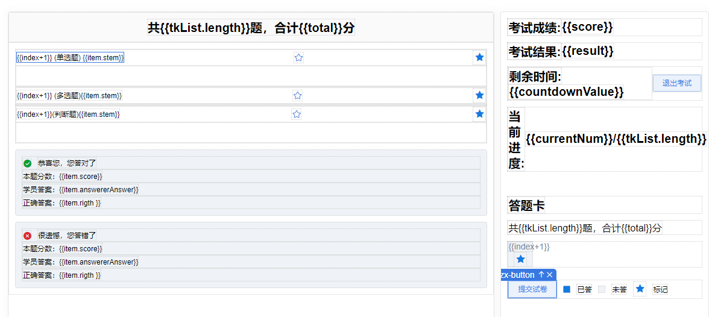
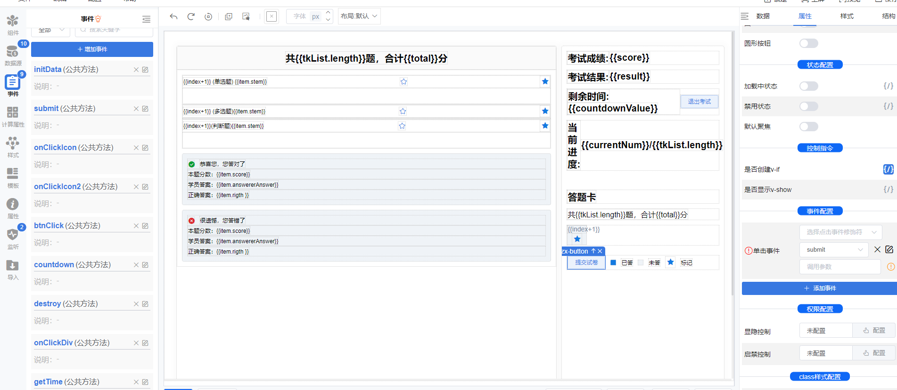
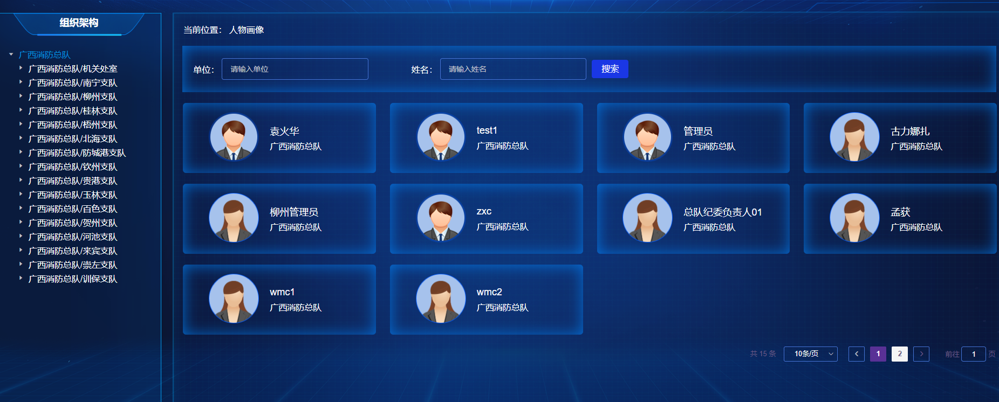
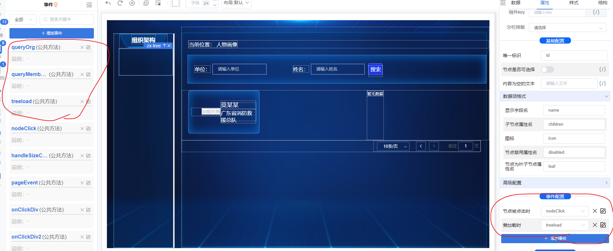
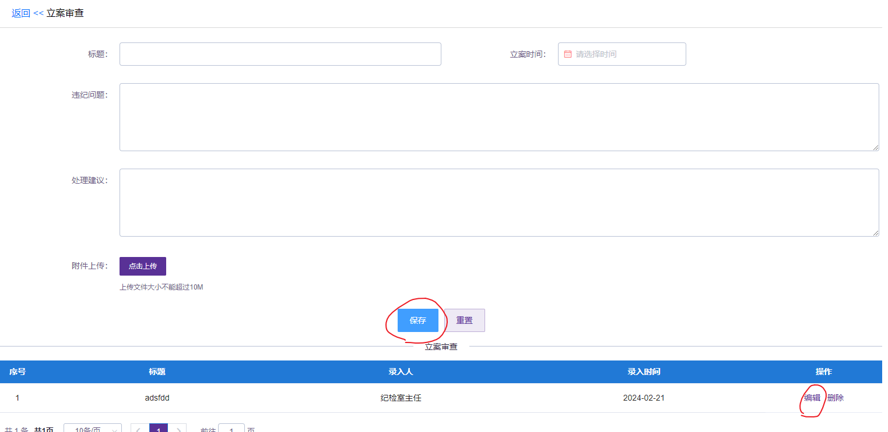
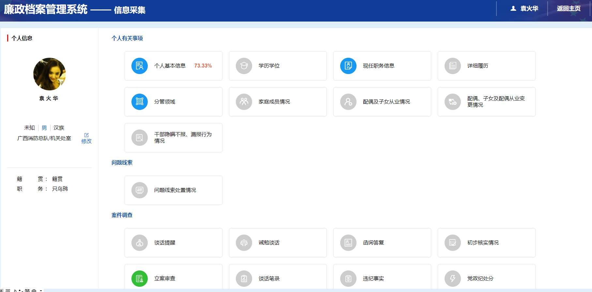

考试





1.在submit方法里，提交答案时，需要进行判断，因为单选和判断题的答案都是一个字符串，而多选则是一个数组，所有的题目是一个数组，然后每个题目选择的选项是数组中的每一个对象的一个属性，利用 Array.isArray(ele.value) ? ele.value.join(',') : ele.value,判断然后将用户选择的多选框的多选都变为变为字符串，单选则不变，因为本身就是字符串

2.然后利用submit里面定义的一个方法，判断答案是否正确，第一个参数是每一个对象的rigth属性（应该就是在给你请求回来题库的时候，答案已经在rigth字段携带过来了），我们通过用户选择的和这个正确答案进行对比，选出正确答案，并且有一点，这个判断里面利用了数组方法sort，应该是用来判断多选答案是否正确的吧

3.countdown方法，就是倒计时的时间戳，当倒计时结束，自动调用提交方法，向后端提交数据，哪怕你有的没有选

```js
<template>
  <div id="devhtml-lug8ck4x" class="div-HrtRBISd">
    <div class="div-nJ0vHL0J">
      <div class="div-3qpkLH4s">
        <span :contenteditable="false" class="span-p55mSIOU"> 共{{ tkList.length }}题，合计{{ total }}分 </span>
      </div>
      <div v-for="(item, index) in tkList" :key="index" :id="item.id" class="div-er91k4Pd">
        <div v-if="item.topic_type == '单选'" class="div-JjCouWKn">
          <div class="div-dE9jk0UD">
            <span :contenteditable="false" class="span-n4jzZDvy"> {{ index + 1 }} (单选题) {{ item.stem }} </span>
            <zx-icon
              icon="el-icon-star-off "
              v-if="!item.mark"
              @click="
                () => {
                  onClickIcon(item);
                }
              "
              class="zxIcon-O6YXcbjx click"
            >
            </zx-icon>
            <zx-icon
              icon="el-icon-star-on "
              v-if="item.mark"
              @click="
                () => {
                  onClickIcon2(item);
                }
              "
              class="zxIcon-Q2g57SMk click"
            >
            </zx-icon>
          </div>
          <zx-radio-field
            :is-field="true"
            :show-label="true"
            label-width="50px"
            item-value="value"
            item-label="label"
            item-disabled="disabled"
            bindlabel="label"
            bindvalue="value"
            :isbutton="false"
            layout="block"
            :options="item.options"
            v-model="item.value"
            :disabled="status == 0"
            class="zxRadioField-4a5aw0U7"
          >
          </zx-radio-field>
        </div>
        <div v-if="item.topic_type == '多选'" class="div-N7IRcXqG">
          <div class="div-2kTEknN3">
            <span :contenteditable="false" class="span-99V3mSYJ"> {{ index + 1 }} (多选题){{ item.stem }} </span>
            <zx-icon
              icon="el-icon-star-off "
              v-if="!item.mark"
              @click="
                () => {
                  onClickIcon(item);
                }
              "
              class="zxIcon-zlct9bqH click"
            >
            </zx-icon>
            <zx-icon
              icon="el-icon-star-on "
              v-if="item.mark"
              @click="
                () => {
                  onClickIcon2(item);
                }
              "
              class="zxIcon-jSBF7qAU click"
            >
            </zx-icon>
          </div>
          <zx-checkbox-field
            :show-label="true"
            :is-field="true"
            label-width="50px"
            item-value="value"
            item-label="label"
            item-disabled="disabled"
            bindlabel="label"
            bindvalue="value"
            layout="block"
            :options="item.options"
            v-model="item.value"
            :disabled="status == 0"
            class="zxCheckboxField-rtOGqjUH"
          >
          </zx-checkbox-field>
        </div>
        <div v-if="item.topic_type == '判断'" class="div-QzmxCiOm">
          <div class="div-AQgsrcAj">
            <span :contenteditable="false" class="span-4SoqqbnD"> {{ index + 1 }}(判断题){{ item.stem }} </span>
            <zx-icon
              icon="el-icon-star-off "
              v-if="!item.mark"
              @click="
                () => {
                  onClickIcon(item);
                }
              "
              class="zxIcon-y1ZRxq6l click"
            >
            </zx-icon>
            <zx-icon
              icon="el-icon-star-on "
              v-if="item.mark"
              @click="
                () => {
                  onClickIcon2(item);
                }
              "
              class="zxIcon-17pEQzNg click"
            >
            </zx-icon>
          </div>
          <zx-radio-field
            :is-field="true"
            :show-label="true"
            label-width="50px"
            item-value="value"
            item-label="label"
            item-disabled="disabled"
            bindlabel="label"
            bindvalue="value"
            :isbutton="false"
            layout="block"
            :options="item.options"
            v-model="item.value"
            :disabled="status == 0"
            class="zxRadioField-5HtB6EK4"
          >
          </zx-radio-field>
        </div>
        <div v-if="status == 0 && item.isCorrect" class="div-lJBpunEv">
          <div class="div-6uVbWcDZ">
            <zx-icon icon="el-icon-success " class="zxIcon-FX3ORnqF"> </zx-icon>
            <span :contenteditable="false" class="span-653AHS7R"> 恭喜您，您答对了 </span>
          </div>
          <div class="div-FtAxHqf9">
            <span :contenteditable="false" class="span-nTjgC9vI mr"> 本题分数：{{ item.score }} </span>
          </div>
          <div class="div-f2UBoF92">
            <span :contenteditable="false" class="span-uczd7LAf mr"> 学员答案：{{ item.answererAnswer }} </span>
          </div>
          <div class="div-2AEiduaX">
            <span :contenteditable="false" class="span-Ex6V2aJU mr"> 正确答案：{{ item.rigth }} </span>
          </div>
        </div>
        <div v-if="status == 0 && !item.isCorrect" class="div-ABAgFylF">
          <div class="div-tB3mSaYG">
            <zx-icon icon="el-icon-error " class="zxIcon-jrrXRESS"> </zx-icon>
            <span :contenteditable="false" class="span-f3l0CLMD"> 很遗憾，您答错了 </span>
          </div>
          <div class="div-SEegNxgD">
            <span :contenteditable="false" class="span-8i2rvdPr mr"> 本题分数：{{ item.score }} </span>
          </div>
          <div class="div-u4vgCED2">
            <span :contenteditable="false" class="span-df6Eo54m mr"> 学员答案：{{ item.answererAnswer }} </span>
          </div>
          <div class="div-U3VpO16C">
            <span :contenteditable="false" class="span-9r3yfMKk mr"> 正确答案：{{ item.rigth }} </span>
          </div>
        </div>
      </div>
    </div>
    <div class="div-wjZxBIHq">
      <div v-if="status == 0" class="div-kYZYAka9">
        <span :contenteditable="false" class="span-sly2b4D3"> 考试成绩: </span>
        <span :contenteditable="false" class="span-9m5hu9tF"> {{ score }} </span>
      </div>
      <div v-if="status == 0 && $route.query.score_line" class="div-z9EV9OSo">
        <span :contenteditable="false" class="span-t4o8rB4A"> 考试结果: </span>
        <span :contenteditable="false" class="span-LLABuEx4"> {{ result }} </span>
      </div>
      <div class="div-J5W3gnvX">
        <div v-if="status == 1" class="div-eOg05Jrw">
          <span :contenteditable="false" v-if="countdownValue" class="span-JMtuHIfU"> 剩余时间: </span>
          <span :contenteditable="false" v-if="countdownValue" class="span-Fo9cdHbt"> {{ countdownValue }} </span>
        </div>
        <zx-button type="primary" :plain="true" size="mini" @click="btnClick" class="zxButton-K0I9psXS"> 退出考试 </zx-button>
      </div>
      <div class="div-LoV4gMaR">
        <span :contenteditable="false" class="span-49E1LUDQ"> 当前进度: </span>
        <span :contenteditable="false" class="span-N8M0diSN"> {{ currentNum }}/{{ tkList.length }} </span>
      </div>
      <div class="div-YzKiTDnN">
        <span :contenteditable="false" class="span-uOIxur4s"> 答题卡 </span>
      </div>
      <div class="div-I0eiR0o7">
        <span :contenteditable="false" class="span-xI6XyBPB"> 共{{ tkList.length }}题，合计{{ total }}分 </span>
      </div>
      <div class="div-LXcRcc7c">
        <div
          v-for="(item, index) in tkList"
          :key="index"
          @click="
            () => {
              onClickDiv(item);
            }
          "
          class="div-nXXG0MmG"
        >
          <span :contenteditable="false" :class="status == 0 ? (item.isCorrect ? 'success' : 'error') : item.value && item.value.length ? 'active' : ' '" class="span-dXRusDoG">
            {{ index + 1 }}
          </span>
          <zx-icon icon="el-icon-star-on " v-if="item.mark" class="zxIcon-twwUjQj8"> </zx-icon>
        </div>
      </div>
      <div class="div-JQSyw2rG">
        <zx-button type="primary" :plain="true" size="mini" v-if="status == 1" @click="submit" class="zxButton-zmGnBUxt"> 提交试卷 </zx-button>
        <div class="div-jSKyho1l"></div>
        <span :contenteditable="false" class="span-FQTcAzqL"> 已答 </span>
        <div class="div-cqrwRLvO"></div>
        <span :contenteditable="false" class="span-gcjWPWYR"> 未答 </span>
        <zx-icon icon="el-icon-star-on " class="zxIcon-GRttaVgX"> </zx-icon>
        <span :contenteditable="false" class="span-4Ba6FZDZ"> 标记 </span>
      </div>
    </div>
  </div>
</template>

<script>
export default {
  data() {
    return {
      self: this,
      tkList: [],
      status: "1",
      total: 0,
      currentNum: 0,
      user: zxUtils.getSessionStorageItem("false", "object"),
      score: 0,
      result: "",
      countdownValue: 0,
      intervalId: 0,
      startTime: "",
    };
  },

  watch: {
    tkList: {
      handler: function (newVal, oldVal) {
        console.log(newVal);

        this.currentNum = 0;
        this.tkList.forEach((ele) => {
          if (ele.value && ele.value.length) {
            this.currentNum++;
          }
        });
      },
      deep: true,
    },
    countdownValue: {
      handler: function (newVal, oldVal) {
        if (newVal == "提交") {
          this.submit();
        }
      },
    },
  },

  methods: {
      //初始化渲染考试，有单选，多选，判断题
    initData() {
      if (this.$route.query.topic_basic_id) {
        this.$axios({
          url: `${globalEnv.API}/examination/getRandomTopic`,
          method: "get",
          params: { id: this.$route.query.id },
        })
          .then((res) => {
            this.tkList = res.data;
            this.total = 0;
            //这是具体遍历的包含单选 多选 判断的题目，以及每一个选项
            this.tkList.forEach((ele, index) => {
              this.total += Number(ele.score);
                //此处label里面的a,b,c,d,e,f的意思就是从后端拿来的每一个对象,将这个对象的属性a,b,c,d,e,f的属性赋值给label，但是可能有的选择题没有e，f选项，我们就看下面注释，这个option就是我们单选组复选组的选项，下方利用$set创建的那个value属性，属性值为空的对象属性就是用户具体选择的选项
              ele.options = [
                { label: ele.a, value: "A" },
                { label: ele.b, value: "B" },
                { label: ele.c, value: "C" },
                { label: ele.d, value: "D" },
                { label: ele.e, value: "E" },
                { label: ele.f, value: "F" },
              ];
                //过滤出存在lebel的选项，因为label如果为空，判断为false，会被过滤掉
              ele.options = ele.options.filter((ele) => {
                return ele.label;
              });
              this.$set(ele, "value", "");
              this.$set(ele, "mark", false);
              // if (topic_type = "单选") {
              //   ele.score = ele.danxt_score

              // }
              // if (topic_type = "多选") {
              //   ele.score = ele.danxt_score
              // }
              // if (topic_type = "判断题") {
              //   ele.score = ele.danxt_score
              // }
            });

            this.$axios({
              url: `${globalEnv.API}/fstj/exam/getResultByUserIdAndExamId`,
              method: "get",
              params: { exam_id: this.$route.query.id },
            }).then((res) => {
              if (res.data && res.data.comtent) {
                console.log(JSON.parse(res.data.comtent));
                this.tkList = JSON.parse(res.data.comtent).topicIsSuccessDtos;
                this.score = JSON.parse(res.data.comtent).point;
                if (Number(this.score) > Number(this.$route.query.score_line)) {
                  this.result = "通过";
                } else {
                  this.result = "未通过";
                }

                this.status = 0;
              }
            });
            console.log("this.tkList", this.tkList);
          })
          .catch((err) => {
            this.$message.error(err.message);
          });
      }
    },
    submit(item) {
      console.log("this.tkList", this.tkList);

      this.status = 0;

      const topicIsSuccessDtos = this.tkList.map((ele) => {
        let newValue = ele.value;
        return {
          ...ele,
          answererAnswer: Array.isArray(ele.value) ? ele.value.join(",") : ele.value,
          id: ele.id,
          isCorrect: areStringsEqualRegardlessOfOrder(ele.rigth, Array.isArray(ele.value) ? ele.value.join(",") : ele.value),
          score: ele.score,
          rigth: ele.rigth,
        };
      });

      const point = topicIsSuccessDtos.reduce((p, c) => {
        console.log("OOOOOOO", c, p);
        if (c.isCorrect) {
          return Number(c.score) + Number(p);
        } else {
          return Number(p);
        }
      }, 0);

      const result = { point, topicIsSuccessDtos };

      const data = {
        exam_id: this.$route.query.id,
        score: point,
        comtent: JSON.stringify(result),
        publish_time: this.startTime,
        total_score: this.total,
        topic_count: this.tkList.length,
        exam_name: this.$route.query.exam_name,
        topic_name: this.$route.query.topic_name,
        topic_basic_id: this.$route.query.topic_basic_id,
        answer_time: this.$route.query.answer_time,
        score_line: this.$route.query.score_line,
      };

      // /examination/addAndModify
      console.log("topicIsSuccessDtos", result);

      this.$axios({
        url: `${globalEnv.API}/fstj/exam/saveOrUpdate`,
        method: "post",
        data,
      })
        .then((res) => {
          location.reload();
          console.log("res");
        })
        .catch((err) => {
          this.$message.error(err.message);
        });

      function areStringsEqualRegardlessOfOrder(str1, str2) {
        const arr1 = str1.split(",").sort();
        const arr2 = str2.split(",").sort();

        return JSON.stringify(arr1) === JSON.stringify(arr2);
      }
    },
    onClickIcon(item) {
      item.mark = true;
    },
    onClickIcon2(item) {
      item.mark = false;
    },
    btnClick(item) {
      this.$router.go(-1);
    },
    countdown() {
      function padZero(number) {
        return number < 10 ? `0${number}` : `${number}`;
      }

      let countdown = (minutes) => {
        // 将分钟数转换为毫秒数
        const milliseconds = Number(minutes) * 60 * 1000;

        // 获取目标时间（当前时间 + 毫秒数）
        const targetTime = new Date().getTime() + milliseconds;

        // 更新倒计时的显示
        function updateCountdown() {
          const currentTime = new Date().getTime();
          const timeDifference = targetTime - currentTime;

          // 计算剩余的分钟和秒
          let remainingHours = Math.floor((timeDifference % (1000 * 60 * 60 * 24)) / (1000 * 60 * 60));
          let remainingMinutes = Math.floor((timeDifference % (1000 * 60 * 60)) / (1000 * 60));
          let remainingSeconds = Math.floor((timeDifference % (1000 * 60)) / 1000);

          remainingHours = padZero(remainingHours);
          remainingMinutes = padZero(remainingMinutes);
          remainingSeconds = padZero(remainingSeconds);

          // 如果倒计时结束，清除定时器
          if (timeDifference <= 0) {
            clearInterval(this.intervalId);
            return "提交";
          }

          return `${remainingHours}:${remainingMinutes}:${remainingSeconds}`;
        }

        // 初始调用一次以防止页面加载时的延迟
        updateCountdown();

        // 每秒更新一次倒计时
        this.intervalId = setInterval(() => {
          this.countdownValue = updateCountdown();
        }, 1000);
      };

      const minutesToCountdown = this.$route.query.answer_time;

      function isNumericString(str) {
        // 使用正则表达式检查字符串是否只包含数字
        return /^\d+$/.test(str);
      }

      if (isNumericString(minutesToCountdown)) {
        // 启动倒计时
        countdown(Number(minutesToCountdown));
        // setInterval(() => {
        //     console.log(this.countdownValue)
        // }, 1000)
      }
    },
    destroy() {
      if (this.intervalId) {
        clearInterval(this.intervalId);
      }
    },
    onClickDiv(item) {
      let elements = document.getElementById(item.id);
      if (elements) elements.scrollIntoView({ behavior: "smooth" });
    },
    getTime() {
      const now = new Date();

      const year = now.getFullYear();
      const month = String(now.getMonth() + 1).padStart(2, "0");
      const day = String(now.getDate()).padStart(2, "0");

      const hours = String(now.getHours()).padStart(2, "0");
      const minutes = String(now.getMinutes()).padStart(2, "0");
      const seconds = String(now.getSeconds()).padStart(2, "0");

      this.startTime = `${year}-${month}-${day} ${hours}:${minutes}:${seconds}`;
    },
  },

  created() {
    this.initData();
  },

  mounted() {
    this.countdown();
    this.getTime();
  },

  destroyed() {
    this.destroy();
  },
};
</script>

```


#### 树形懒加载的流程（广西消防廉政档案）



圈住的就是懒加载的核心



```js
methods:{
    function queryOrg(id){
        this.currentid = ''
this.currentName = ''

        //这一步拿到的是一个我不知道有啥用的东西，我也不知道有啥用，貌似和懒加载无关
const res = await this.$axios({
  url: `/userresource/ent/api/getDeptListByEntUserId?userId=${this.user.userid}`,
  method: 'get',
})
//这一步有些不太明白
if (res.data) {
  const deptArray = res.data[0].idlevel.split('_')
  const nameArray = res.data[0].ssdeptname.split('/')

  if (deptArray.length && deptArray.length > 1) {
    this.currentid = deptArray[1]
    this.currentName = nameArray[1]
  } else {
    this.currentid = deptArray[0]
    this.currentName = nameArray[0]
  }

  if (nameArray[1] == '机关处室') {
    this.currentid = deptArray[0]
    this.currentName = nameArray[0]
  }

  this.expandArr = [this.currentid]
}


//这里就是获取到你点击节点的所有子节点及其具体信息
const params = {
  type: 'o',
  pid: 0,
  queryParam: ''
}
if (id) params.pid = id
else params.pid = this.currentid
// params.queryParam = '广西消防总队'
return this.$axios({
  url: '/userresource/complexQueryApi/queryComplexList',
  method: 'get',
  params
}).then(res => {
  console.log("res.data", res.data)
  return res.data
})
    }
}

//获取具体某个节点所包含的人员信息
function queryMemberList(id){
this.$axios({
  url: '/userresource/entUser/api/getEntDeptUserList',
  method: 'get',
  params: {
    pageNum: this.pageData.pageNum,
    pageSize: this.pageData.pageSize,
    deptId: id,
    hassub: 0,
    // entId: id,
    access_token: sessionStorage.getItem('access_token'),
    queryStr: this.form.queryStr ? this.form.queryStr : null,
    deptname: this.form.deptname ? this.form.deptname : null
  }
}).then(res => {

  this.pageData = {
    ...this.pageData,
    list: res.data ? res.data.list : [],
    total: res.data ? res.data.total : 0,
  }
})
}

//这是卓迅的树形组件内置的懒加载方法，当懒加载的时候会调用，默认初始化页面会调用一次
function treeload(node,resolve){
    //这个data可以获取到我们点击的那个节点的一些属性，包含这个节点的子节点及子节点的一些属性
    const data = node.data
console.log("MMMMUUUU", node)
this.queryOrg(data.id).then(res => {
  if (!this.defaultSelectOrgId && res.length) {
    //this.defaultSelectOrgId = res[0].id
    if (!data.id) {
      this.defaultSelectOrgId = this.currentid
    } else {
      this.defaultSelectOrgId = res[0].id
    }
      //获取具体节点的人员信息
    this.queryMemberList(this.defaultSelectOrgId)
    let treeNode = {
      type: "o",
      id: this.currentid,
      name: this.currentName,
      children: res
    }
    //这个地方记住啊，orgList就是我们树形绑定数据，这里是我们初始化页面的时候默认展开第一级，将第一级和第二级数据绑定在树形上
    this.orgList = [treeNode]
    console.log("this.orgList", this.orgList)
  }
  resolve(res.map(item => {
    return {
      ...item,
      leaf: item.type === 'u'
    }
  }))
})
}

//内置的树形点击事件，点击某一个节点就调用获取具体人员信息的方法
function nodeClick(value,node,data){
    // 将你点击的那个树节点的id传给接口
this.selectOrgId = value.id
this.queryMemberList(this.selectOrgId)
}
```

#### 新增还是修改判断



此处的新增和修改是同一个接口，然后当我们点击表格的编辑的时候，就会将我们点击的这一行，也就是这个row赋给一个变量，然后点击保存时候进行判断，当这个变量存在，在给接口传递字段的时候多传递一个这个row的id，就证明我是修改；而新增就不传递这个id，以此来判断

